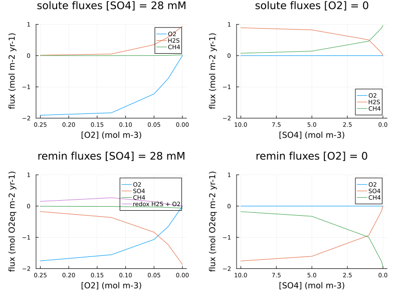

# Sediment Boudreau (1996) test cases

To run sediment test cases from [Boudreau1996](@cite), assuming the Julia environment `PALEOsediment/examples` has already been activated:

    julia> cd("examples/boundreau1996")
    julia> include("PALEO_examples_sediment.jl")

This will run and plot output (NB: the first run will be slow as Julia JIT compiles the code).

The configuration includes three sediment columns, with:
1. Shelf / slope case
2. Rise case
3. Rise, no bioturbation

NB: this configuration doesn't include N, so results differ in detail from the paper.

# Oceanfloor [O2] and [SO4] gradients

    julia> include("PALEO_examples_sediment_x10.jl")

The configuration includes ten sediment columns, with the physical environment for the [Boudreau1996](@cite) shelf/slope case,
no bioturbation, and Corg input with two reactivity fractions (a combination of the high-reactivity fraction from the shelf/slope case, and the low reactivity fraction from the rise case).

1. Columns 1-5: oceanfloor [O2] gradient, constant [SO4] = 28mM
2. Columns 6-10: oceanfloor [SO4] gradient, at constant [O2] = 0

Summary plots show oceanfloor solute fluxes and remineralization pathways:

###### Figure 1
*Oceanfloor solute fluxes and remineralization pathways vs oceanfloor [O2] and [SO4] concentration*